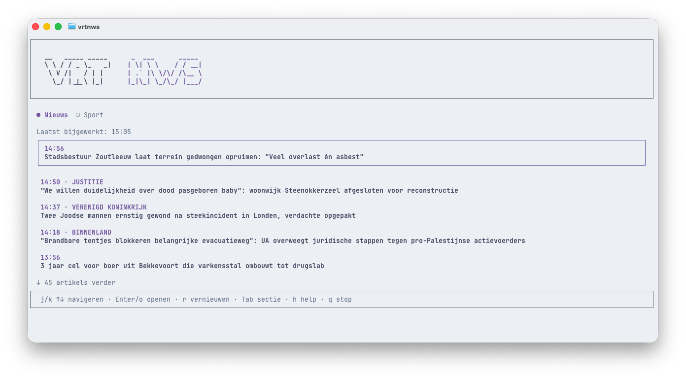

# vrtnws

Read VRT NWS and Sporza from your terminal.



## Install

Install the CLI globally from npm.

```bash
npm install --global vrtnws
```

Run it.

```bash
vrtnws
```

## What It Does

`vrtnws` opens a terminal news reader with two sections.

1. Nieuws, from VRT NWS
2. Sport, from Sporza

Feeds refresh automatically every 5 minutes. You can also refresh the current section manually.

## Controls

1. `j` or `↓`: Move down
2. `k` or `↑`: Move up
3. `Enter` or `o`: Open the selected article
4. `o`: Open the full article in your browser from the article view
5. `Tab`: Switch between Nieuws and Sport
6. `r`: Refresh the current feed
7. `h`: Show help
8. `ESC` or `b`: Go back to the list
9. `q`: Quit

## Requirements

Node.js 22 or newer.
